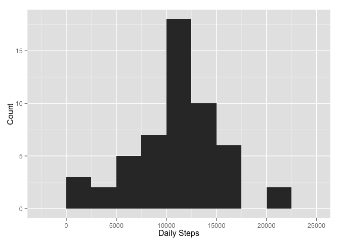
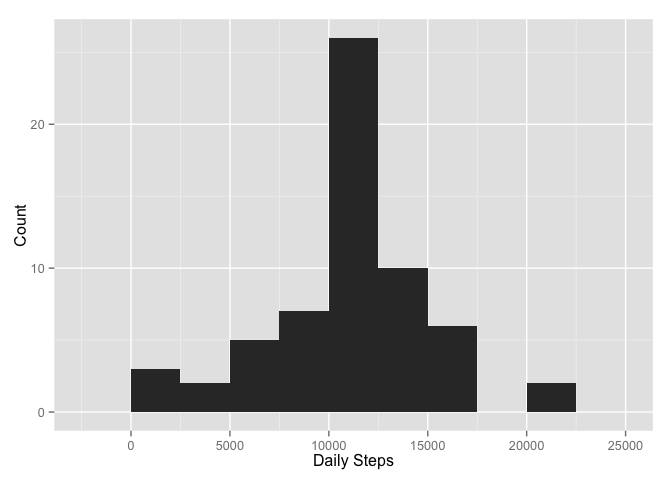
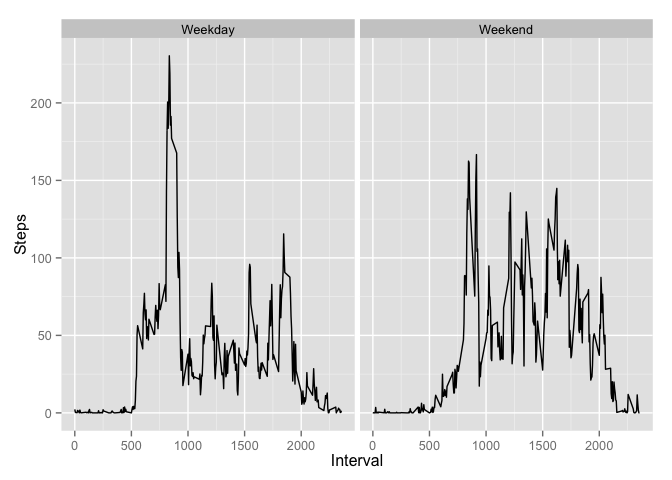

# Reproducible Research: Peer Assessment 1


## Loading and preprocessing the data

```r
data <- read.csv("activity.csv", stringsAsFactor = F)
data$date <- as.Date(data$date)
```

## What is mean total number of steps taken per day?

```r
dailySteps <- aggregate(data$steps, list(date = data$date), sum)
dailyStepsMean <- mean(dailySteps$x, na.rm=T)
print(dailyStepsMean)
```

```
## [1] 10766.19
```

## What is the average daily activity pattern?

```r
library(ggplot2)
qplot(dailySteps$x, binwidth=2500, xlab="Daily Steps", ylab="Count")
```

 

## Imputing missing values

```r
## NA values imputed by replacing with the average steps for that interval
naRows <- which(is.na(data$steps))
dataNoNA <- data
for (row in naRows){
    interval <- dataNoNA[row,]$interval
    newVal <- mean(data[data$interval == interval,]$steps, na.rm = TRUE)
    dataNoNA[row,]$steps <- newVal
}

## Check if the data changes with the NA values imputed (not really)
dailyStepsNoNA <- aggregate(dataNoNA$steps, list(date = dataNoNA$date), sum)
qplot(dailyStepsNoNA$x, binwidth=2500, xlab="Daily Steps", ylab="Count")
```

 

```r
dailyStepsNoNAMean <- mean(dailyStepsNoNA$x)
dailyStepsNoNAMedian <- median(dailyStepsNoNA$x)
```

## Are there differences in activity patterns between weekdays and weekends?

```r
## Add column for day type and fill it with Weekend or Weekday based on date
weekdays <- c("Monday", "Tuesday", "Wednesday", "Thursday", "Friday")
dayCheck <- sapply(dataNoNA$date, weekdays)
dayType <- dayCheck %in% weekdays
dayType[dayType == TRUE] <- "Weekday"
dayType[dayType == FALSE] <- "Weekend"
dataNoNA$dayType <- as.factor(dayType)
rm(weekdays, dayCheck)

avgDaily <- aggregate(dataNoNA$steps, list(Day = dataNoNA$dayType, Interval = dataNoNA$interval), mean)
qplot(Interval, x, facets=.~Day, data=avgDaily, geom="line", ylab="Steps")
```

 

